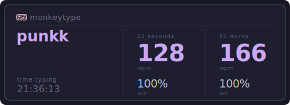

# monkeytypecard

Generate an SVG stats card for your [Monkeytype](https://monkeytype.com) profile to embed in your GitHub README.



## Features

- Live data from the public Monkeytype API (personal bests, accuracy, time typing)
- 187 themes pulled straight from Monkeytype — with a visual color-swatch picker
- Searchable theme list and a random theme button
- Configurable time (15/30/60/120s) and word (10/25/50/100) modes
- Copy URL or Markdown to clipboard for easy embedding
- SVG output that works anywhere images are supported

## Usage

Add this to your GitHub README (replace `YOUR_USERNAME`):

```markdown

```

### Query Parameters

| Parameter   | Default       | Options                 |
| ----------- | ------------- | ----------------------- |
| `username`  | `guest`       | any Monkeytype username |
| `theme`     | `serika_dark` | any of the 187 themes   |
| `timeValue` | `15`          | `15`, `30`, `60`, `120` |
| `wordValue` | `10`          | `10`, `25`, `50`, `100` |

### Example

```
/monkeytype.svg?username=punkk&theme=nord_light&timeValue=60&wordValue=50
```

## Getting Started

### Prerequisites

- Python 3.10+

### Setup

```bash
git clone https://github.com/YOUR_USERNAME/monkeytypecard.git
cd monkeytypecard
python -m venv venv
source venv/bin/activate
pip install flask requests python-dotenv
```

### Run

```bash
cd src
python app.py
```

Open [http://localhost:5000](http://localhost:5000) to use the card builder.

## Project Structure

```
src/
  app.py                  # Flask app, SVG generation, routes
  services/
    monkeytype.py         # Monkeytype API client
  static/
    styles.css            # Frontend styling
    builder.js            # Theme picker, preview, clipboard
    themes.json           # 187 Monkeytype themes
  templates/
    builder.html          # Card builder UI
```

## API Endpoints

| Route                 | Description                      |
| --------------------- | -------------------------------- |
| `GET /`               | Card builder UI                  |
| `GET /monkeytype.svg` | Generate SVG card (query params) |
| `GET /api/themes`     | JSON list of available themes    |

## Built With

- [Flask](https://flask.palletsprojects.com/) — web framework
- [Monkeytype API](https://monkeytype.com) — typing stats data
- Vanilla JS, CSS — no frontend frameworks

## License

MIT
